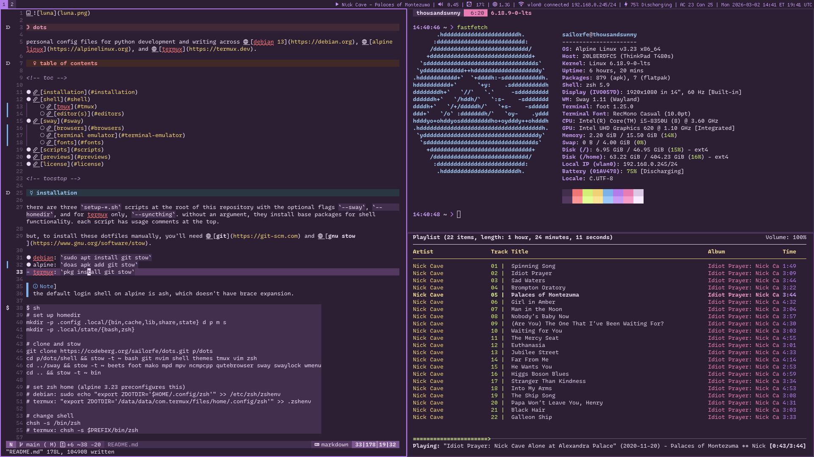
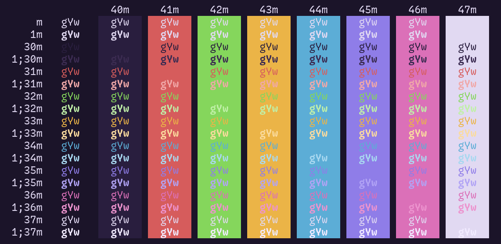
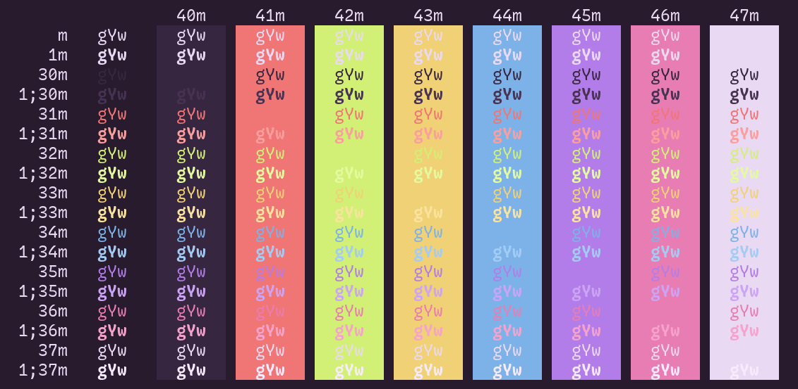
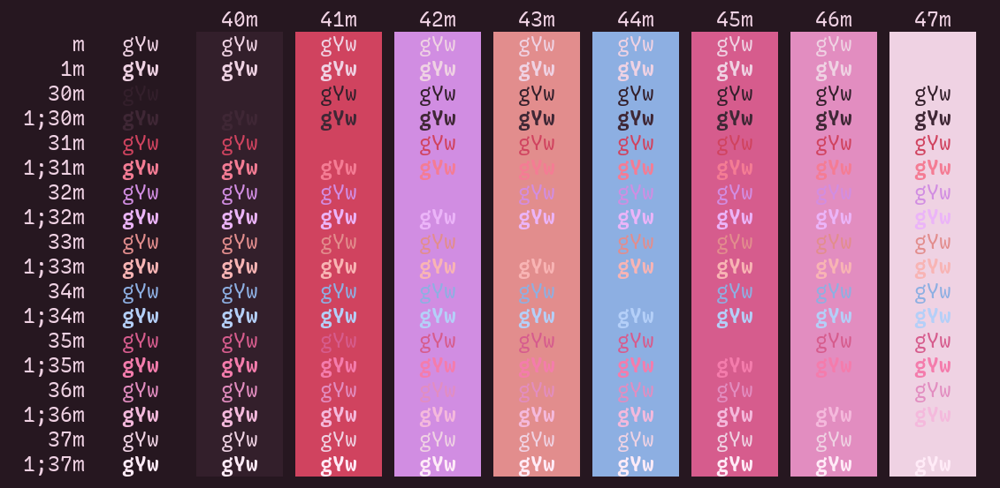

# dots

personal config files for python development and writing across [debian 13](https://debian.org), [alpine linux](https://alpinelinux.org), and [termux](https://termux.dev).

### table of contents

<!-- toc -->

- [installation](#installation)
- [shell](#shell)
    * [tmux](#tmux)
    * [editor(s)](#editors)
- [sway](#sway)
    * [browsers](#browsers)
    * [terminal emulator](#terminal-emulator)
    * [fonts](#fonts)
- [scripts](#scripts)
- [license](#license)

<!-- tocstop -->

## installation

there are three `setup-*.sh` scripts at the root of this repository with the optional flags `--sway`, `--dotfiles`, `--laptop`, and for termux only, `--syncthing`. without an argument, they install base packages for shell functionality. each script has usage comments at the top.

but, to install these dotfiles manually, you'll need [**git**](https://git-scm.com) and [**gnu stow**](https://www.gnu.org/software/stow).

- debian: `sudo apt install git stow`
- alpine: `doas apk add git stow`
- termux: `pkg install git stow`

> [!NOTE]
> the default login shell on alpine is ash, which doesn't have brace expansion.

```sh
# set up homedir
mkdir -p .config .local/{bin,cache,lib,share,state} d p m s
mkdir -p .local/state/{bash,zsh}

# clone and stow
git clone https://codeberg.org/sailorfe/dots.git p/dots

cd p/dots
# common packages
stow -t ~ bin git nvim ssh themes tmux vim zsh
# gui packages
stow -t ~ foot mako qutebrowser sway swaylock wmenu
# media packages
stow -t ~ beets mpd mpv ncmpcpp zathura

# set zsh home (alpine 3.23 preconfigures this)
# debian: sudo echo "export ZDOTDIR='$HOME/.config/zsh'" >> /etc/zsh/zshenv
# termux: echo "export ZDOTDIR='/data/data/com.termux/files/home/.config/zsh'" >> .zshenv

# change shell
chsh -s /bin/zsh
# termux: chsh -s $PREFIX/bin/zsh
```

## shell

i use [zsh](https://zsh.org) as my login shell and script in [bash](https://www.gnu.org/software/bash). i don't use anything beyond `zsh-autosuggestions`, `zsh-completions`, and `zsh-syntax-highlighting`. i've made my shell config pretty much plug-and-play by hardcoding my prompts' hex codes and automating their selection by hostname with a case statement because i need at minimum three visual cues to know where tf i am.

i'm trying to move away from using relying on aliases, so now all i have is `--color` and `--group-directories-first` appended to all `ls` variations. previously, i lifted a bunch of git aliases from [xero](https://github.com/xero/dotfiles/blob/main/zsh/.config/zsh/06-aliases.zsh), but they weren't helpful to me for actually intimately learning the git cli.

### tmux

i use tmux on machines without GUIs, so my clamshelled macbook air 2017 devbox and termux, or if i've booted one of my sway machines for just a second to do something in the tty. i also have some convoluted scripts on my desktop for opening tmux sessions with mpv, but i'm trying to make more use of sway's scratchpad for keeping terminals in the background.

tmux is best on the devbox where i do more prolonged python work. i will activate a virtual environment outside of tmux and then `tmux -new -s $PROJECT` in the project directory, but this rarely happens because sessions persist for days if not weeks.

### editor(s)

i use neovim for writing prose and code, and i do more of the former than the latter, with the combined might of [the built-in lsp](https://github.com/neovim/nvim-lspconfig) and [nvim-treesitter](https://github.com/nvim-treesitter/nvim-treesitter). i manage plugins with [lazy](https://github.com/folke/lazy.nvim), but i've been curious about [forgoing a plugin manager altogether](https://whynothugo.nl/journal/2026/01/08/you-dont-need-a-neovim-plugin-manager/)...

- **language servers + linters**: [ty](https://docs.astral.sh/ty/features/language-server/), [clangd](https://clangd.llvm.org/), [Marksman](https://github.com/artempyanykh/marksman), [bashls](https://github.com/bash-lsp/bash-language-server?tab=readme-ov-file#neovim), [shellcheck](https://shellcheck.net), among others
- **formatters**: [ruff](https://astral.sh/ruff), [prettierd](https://github.com/fsouza/prettierd)/[prettier](https://github.com/prettier/prettier), [shfmt](https://github.com/mvdan/sh), [markdown-toc](https://github.com/jonschlinkert/markdown-toc)
- **notable plugins**:
  - [bullets.vim](https://github.com/bullets-vim/bullets.vim): for the markdown-pilled
  - [conform.nvim](https://github.com/stevearc/conform.nvim): configured to format on `:w`
  - [indent-blankline.nvim](https://github.com/lukas-reineke/indent-blankline.nvim): indentation guides, very important for python and yaml
  - my own colorschemes made with [lush.nvim](https://github.com/rktjmp/lush.nvim) and [shipwright.nvim](https://github.com/rktjmp/shipwright.nvim): [perona](https://codeberg.org/sailorfe/perona.nvim), [luna](https://codeberg.org/sailorfe/luna.nvim), [moonqueen](https://codeberg.org/sailorfe/moonqueen.nvim)
  - [mason.nvim](https://github.com/mason-org/mason.nvim): manages language servers/linters/formatters that i find annoying to hunt down or don't want from debian repositories or other package managers. so basically anything that i can't get with `uv`
  - [mini.nvim](https://github.com/nvim-mini/mini.nvim): comment, completion, diff, files, git, icons, notify, pairs, pick, snippets, splitjoin, surround, starter, statusline.
  - [no-neck-pain.nvim](https://github.com/shortcuts/no-neck-pain.nvim): 👵🏼
  - [render-markdown.nvim](https://github.com/MeanderingProgrammer/render-markdown.nvim): really great for codeblocks and such
  - [telescope.nvim](https:///github.com/nvim-telescope/telescope.nvim): tbh i mostly use this for `:Telescope lsp_document_symbols`
  - [trouble.nvim](https://github.com/folke/trouble.nvim): diagnostics
  - [wordcount.nvim](https://codeberg.org/saiilorfe/wordcount.nvim): my `g <C-g` workaround for ignoring fenced YAML in markdown files

i have `Space` as my leader key in part because i use [a 40% mechanical keyboard](https://codeberg.org/sailorfe/qmk-planck) that puts `\` and `|` on the same key as `'`/`"`.

a fair bit of my config is geared toward writing markdown, which i've been doing in neo/vim for years before i started programming. it all relies on vim's built-in spellcheck and a Markdown `ftplugin` i've tinkered with longer than anything.

i make liberal use of neovim's `runtimepath` and love squirreling stuff away in `XDG_{DATA,STATE}_HOME/nvim`.

```sh
.config/nvim
├── ftplugin
│   ├── markdown.lua
│   └── python.lua
├── init.lua
├── lazy-lock.json
└── lua
    ├── core
    │   ├── editor.lua
    │   ├── init.lua    => load order for core
    │   ├── keys.lua
    │   ├── lazy.lua
    │   ├── theme.lua
    │   └── ui.lua
    ├── plugins
    │   └── {21 and four are colorschemes!}
    └── wordcount
        └── init.lua
```

i also keep a light `vimrc` for when any of the above feels too busy or opinionated. i have aggressively moved most vim state files to `XDG_STATE_HOME/vim`:

```sh
.config/vim
├── ftplugin
│   ├── markdown.vim
│   └── python.vim
└── vimrc
```

## sway

| moonqueen                                 | luna                            | perona                              |
| ----------------------------------------- | ------------------------------- | ----------------------------------- |
|  |  |  |

i don't toil away at ricing linux, but what i do have are three custom neovim colorschemes that serve the functional purpose of reminding me what host i'm on, and which i want my machines with [sway](https://swaywm.org/) to match. besides colors, this customization takes different swaybar scripts per device (i don't need battery on desktop, for example). my modular sway setup looks like

```sh
.
├── config
├── config.d
│   ├── 00-base             => keybindings
│   ├── 10-luna             => colorschemes
│   ├── 10-moonqueen
│   ├── 10-perona
│   ├── 20-goingmerry       => device-specific workspaces
│   └── 20-thousandsunny    => exec's user services on alpine
├── desktop.sh
└── laptop.sh
```

where `config` is only a few lines to `include` relevant files from `config.d` in load order. `10-$PALETTE` correspond to my nvim schemes. `20-$HOSTNAME` differ mostly by my laptop occasionally being plugged into a 4k tv; otherwise, i give myself six workspaces and the tray at 0 and keep it more or less the same besides sending one to hdmi.

### browsers

my browser of choice is either [qutebrowser](https://qutebrowser.org/) or [librewolf](https://librewolf.net/). qutebrowser is written and configured with python, so it's a lot of fun. i also sometime go rogue and use [w3m](https://github.com/tats/w3m).

### terminal emulator

i love [foot](https://codeberg.org/dnkl/foot), the default wayland terminal emulator, but i sometimes switch to [alacritty](https://alacritty.org) when utf-8 gets weird. there is config for [rio](https://rioterm.com), [ghostty](https://ghostty.org), and [wezterm](https://wezterm.org) in here, but i generally stick to foot.

### fonts

fonts are some of my greatest passions. these days i rotate between

- [recursive mono casual](https://www.recursive.design/): very fun and almost pen-like with great italics. i also use the sans serif for my resumes.
- [cozette](https://github.com/the-moonwitch/Cozette): takes enabling bitmapped fonts on debian and alpine. i use this in my swaybar, wmenu, and rarely-seen sway window titles. it's also my cope for having 1080p monitors. i will sincerely look at 11pt bitmaps to get 3 neovim windows side by side.
- [ibm 3270](https://packages.debian.org/source/trixie/3270font) or [3270 nerd font](https://www.programmingfonts.org/#font3270): honestly? extremely readable.

in the past, i've gotten a lot of mileage out of [iosevka](https://typeof.net/Iosevka/) and [jetbrains mono](https://www.jetbrains.com/lp/mono/).

## scripts

most of the scripts in the `bin` package are for sway, swaybar, wmenu, and make use of libnotify through [mako](https://github.com/emersion/mako). some are just trying to get things to work on alpine and sway, e.g. with openrc/busybox and wayland. highlights:

- `battery-alert`: for alpine laptop, requires `elogind` as a boot service.
- `player-status`: displays audio/video player information as plain text for swaybar. requires playerctl and mpd-mpris.
- `wl-colorpick`: hex code picker for wayland. depends on grim, slurp, imagemagick, libnotify + a notification daemon.

## license

these configs and scripts are released with [the unlicense](https://unlicense.org) / [kopimi](https://kopimi.com).


