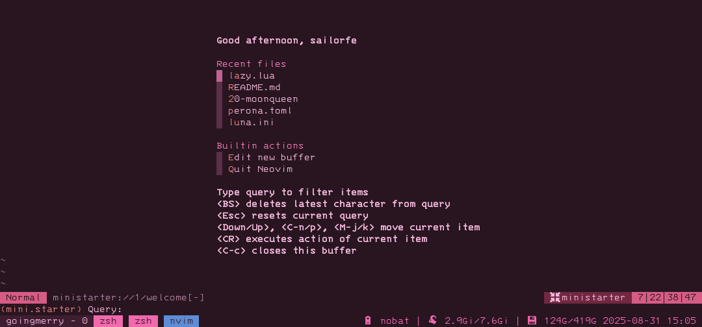
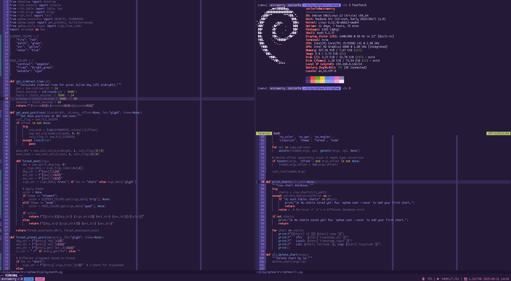

these are my configuration files for an overwhelmingly [debian linux](https://debian.org) ecosystem across four devices of advancing age. the newest is termux on android and the oldest is an hp compaq elite 8000 usdt.

my desktop and laptop use [sway](https://swaywm.org). wayland is pretty good these days, but needy in that on debian it requires a slew of helper packages to cooperate with electron apps and the like.

this repo is designed to be modular and minimal. i'm neither or a gamer or a sysadmin or even that serious a ricer, just someone who frequently nukes my installations (i swear by separate `/home` and `/`).

### table of contents

- [homedir](#homedir)
- [dependencies](#dependencies)
- [installation](#installation)
- [shell](#shell)
- [neovim](#neovim)
- [sway](#sway)
- [previews](#previews)

<a name="homedir"></a>
## homedir layout

i follow the [xdg base directory specification](https://specifications.freedesktop.org/basedir-spec/latest/) and try my best to keep hidden files tamed. i keep [xdg-user-dirs](https://www.freedesktop.org/wiki/Software/xdg-user-dirs/) under `.local` and the more colloquial `$XDG_{DOCUMENTS,MUSIC,PICTURES,VIDEOS}_DIR` visible at `~` with single-letter toplevels.

```sh
~
|-- .config/        => $XDG_CONFIG_HOME
|   |-- bash/
|   |-- nvim/
|   |-- sway/
|   |-- tmux/
|   `-- zsh/        => $ZDOTDIR
|       `-- .zshrc
|-- .local
|   |-- bin/
|   |-- cache/      => $XDG_CACHE_HOME
|   |-- lib/        => $GOPATH, $CARGO_HOME, etc
|   |-- share/      => $XDG_DATA_HOME
|   `-- state/      => $XDG_STATE_HOME
|-- d/
|   |-- flor{ilegium}   => notes -> syncthing
|   `-- etc...
|-- m/
|   |-- app/            => *.deb, *.iso
|   |-- doc/            => *.cbz, *.epub, *.pdf
|   |-- img/
|   |   `-- cap/            => $GRIM_DEFAULT_DIR
|   |-- mus/            => music library -> syncthing
|   `-- vid/
|-- p/                  => my source code
|   `-- dots/               => this repo!
`-- s/                  => not-my source code
```

before i even clone this repo, i run a command like this:

```sh
mkdir ~/.config &&
    mkdir -p ~/.local/{bin,cache,lib,share,state} &&
    mkdir -p ~/.local/state/{bash,zsh} &&
    mkdir -p ~/{d,m,p,s}
```

this has gone through some evolution through the years, but it's the combined influence of [xero](https://github.com/xero/dotfiles) and [elly](https://elly.town/d/blog/2021-10-06-homedir.txt). i feel especially strongly about xdg and develop and configure with it in mind!

<a name="dependencies"></a>
## dependencies

it goes without saying that this setup depends on git, and with it [gnu stow](https://www.gnu.org/software/stow/), which basically manages a mess of symlinks from this repository into my `.config` and home directories. i pretty much run debian all the time out of package manager muscle memory, and if i ever stray it's to alpine or something arch-based:

- `apt install git stow`
- `apk add git stow`
- `pacman -S git stow`

once you've made the above filetree or at least decided where you want this repo to go, run `git clone https://codeberg.org/sailorfe/dots.git ~/p/dots`.

<a name="installation"></a>
## installation

you can run `debian.sh` at the root of this repository or run its functions manually like

```sh
# move zsh home
sudo echo "export ZDOTDIR='$HOME'/.config/zsh" >> /etc/zsh/zshenv

# clone & stow dotfiles
cd ~/p &&
    git clone ssh://git@codeberg.org/sailorfe/dots.git &&
    cd dots/shell &&
    stow -t ~ *

    # if with a visual environment
    cd ~/p/dots/sway &&
    stow -t ~ *
```

the script has a few optional flags for whether this is a server or desktop installation:

```sh
./debian.sh --minimal       # only shell, ranger, and tmux
./debian.sh --sway          # only sway
./debian.sh --full          # shell with sway environment
./debian.sh --homedir       # sets up homedir and zdotdir
```

<a name="shell"></a>
## shell

i use zsh on all devices, though i keep a close-enough bash config. i've made my shell config pretty much plug-and-play by hardcoding my prompts' hex codes and automating their selection by hostname with a case statement because i need at minimum three visual cues to know where tf i am.

one of my quirks is i changed all variations of `ls` to use `--group-directories-first`, which just makes sense to me. i'm a fan of `fish`-like `zsh-syntax-highlighting`, too. i am always in a [tmux](https://github.com/tmux/tmux) session for the practical reason of walking away from venv work in my dev box, and the silly reason of constantly having [mpv](https://mpv.io/) or [ncmpcpp](https://github.com/ncmpcpp/ncmpcpp) open on my desktop.

<a name="neovim"></a>
## neovim

i use neovim for writing prose and code, and i do more of the former than the latter, with the combined might of [the built-in lsp](https://github.com/neovim/nvim-lspconfig) and [nvim-treesitter](https://github.com/nvim-treesitter/nvim-treesitter). i manage plugins with [lazy](https://github.com/folke/lazy.nvim), but i've been curious about [forgoing a plugin manager altogether](https://whynothugo.nl/journal/2026/01/08/you-dont-need-a-neovim-plugin-manager/)...

- **language servers**: [ty](https://docs.astral.sh/ty/features/language-server/), [clangd](https://clangd.llvm.org/), [Marksman](https://github.com/artempyanykh/marksman), among others
- **notable plugins**:
    * [bullets.vim](https://github.com/bullets-vim/bullets.vim): for the markdown-pilled
    * [indent-blankline.nvim](https://github.com/lukas-reineke/indent-blankline.nvim): indentation guides, very important for python and yaml
    * [gitsigns.nvim](https://github.com/lewis6991/gitsigns.nvim): unobtrusive git diff in the number gutter
    * my own colorschemes made with [lush.nvim](https://github.com/rktjmp/lush.nvim) and [shipwright.nvim](https://github.com/rktjmp/shipwright.nvim):
        + [perona](https://codeberg.org/sailorfe/perona.nvim)
        + [luna](https://codeberg.org/sailorfe/luna.nvim)
        + [moonqueen](https://codeberg.org/sailorfe/moonqueen.nvim)
    * [mason.nvim](https://github.com/mason-org/mason.nvim): manages language servers that i find annoying to hunt down or don't want from debian repositories or other package managers. so basically anything that i can't get with `uv`
    * [mini.nvim](https://github.com/nvim-mini/mini.nvim): comment, completion, files, git, icons, notify, pairs, pick, snippets, splitjoin, surround, starter, statusline
    * [no-neck-pain.nvim](https://github.com/shortcuts/no-neck-pain.nvim): 👵🏼
    * [render-markdown.nvim](https://github.com/MeanderingProgrammer/render-markdown.nvim): really great for codeblocks and such
    * [telescope.nvim](https:///github.com/nvim-telescope/telescope.nvim): tbh i mostly use this for `:Telescope lsp_document_symbols`
    * [trouble.nvim](https://github.com/folke/trouble.nvim): diagnostics

i have `Space` as my leader key in part because i use [a 40% mechanical keyboard](https://codeberg.org/sailorfe/qmk-planck) that puts `\` and `|` on the same key as `'`/`"`.

i have a fair bit of config geared toward writing markdown, which i've been doing in neo/vim for years before i started programming. it all relies on vim's built-in spellcheck and a Markdown `ftplugin` i've tinkered with longer than anything. i make liberal use of neovim's `runtimepath` and love squirreling stuff away in `XDG_{DATA,STATE}_HOME`.

```sh
~
|-- .local/
|   |-- share/
|   |   `-- nvim/
|   |       |-- lazy/
|   |       |-- mason/
|   |       |-- spell/
|   |       `-- undo/
|   `-- state/
|       `-- nvim/
|           |-- lsp.log
|           `-- mason.log
`-- .config/
    `-- nvim/
        |-- ftplugin/
        |   |-- markdown.lua
        |-- lua/
        |   |-- core/
        |   |   |-- editor.lua
        |   |   |-- keys.lua
        |   |   |-- lazy.lua
        |   |   `-- ui.lua
        |   `-- plugins/
        |       `-- {not too many!}
        `-- init.lua
```

<a name="sway"></a>
## sway

i don't toil away at ricing linux, but what i do have are three custom neovim colorschemes that serve the functional purpose of reminding me what host i'm on, and which i want my machines with [sway](https://swaywm.org/) to match. besides colors, this customization takes different swaybar scripts per device (i don't need battery on desktop, for example). my modular sway setup looks like

```sh
.config/sway
|-- config.d/
|   |-- 00-base
|   |-- 10-goingmerry      => desktop
|   |-- 10-thousandsunny   => thinkpad
|   |-- 20-luna
|   |-- 20-moonqueen
|   `-- 20-perona
|-- config
|-- desktop.sh
`-- laptop.sh           => swaybar status scripts
```

where `config` is only a few lines to `include` relevant files from `config.d`. `10-$hostname` differ mostly by my laptop occasionally being plugged into a 4k tv; otherwise, i give myself six workspaces and the tray at 0 and keep it more or less the same besides sending one to hdmi. `20-$palette` correspond to my nvim schemes.

my browser of choice is either [qutebrowser](https://qutebrowser.org/) or [librewolf](https://librewolf.net/). qutebrowser is written and configured with python, so it's a lot of fun.

i love [foot](https://codeberg.org/dnkl/foot), the default wayland terminal emulator, but i sometimes switch to [alacritty](https://alacritty.org) on my desktop. i also test drive weird new ones like [rio](https://rioterm.com) or [ghostty](https://ghostty.org).

fonts are some of my greatest passions. these days i rotate between

- [recursive mono casual](https://www.recursive.design/)
- [cozette](https://github.com/the-moonwitch/Cozette)
- [ibm 3270](https://packages.debian.org/source/trixie/3270font) or [3270 nerd font](https://www.programmingfonts.org/#font3270)

<a name="previews"></a>
## previews


