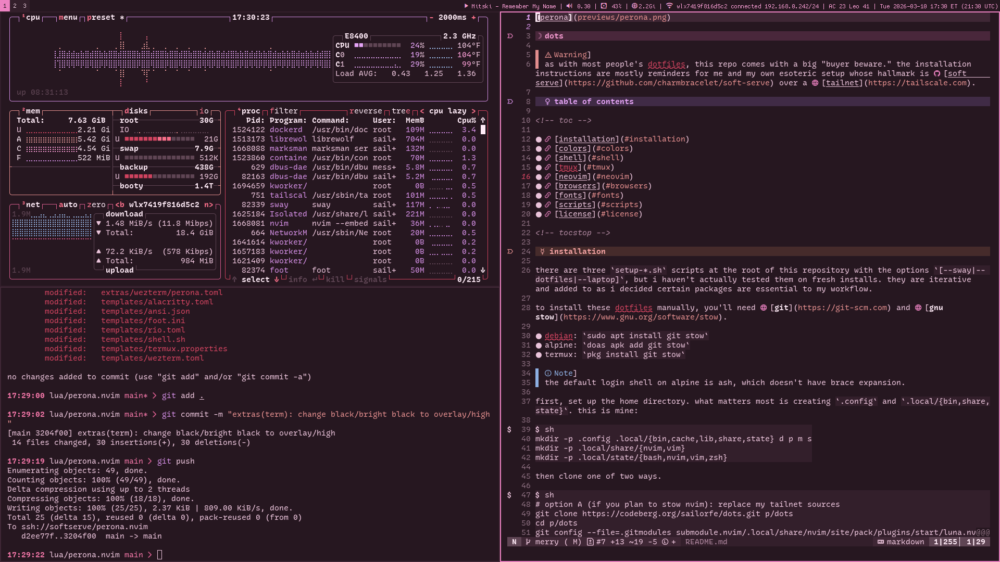

# dots

> [!WARNING]
> as with most people's dotfiles, this repo comes with a big "buyer beware." the installation instructions are mostly reminders for me and my own esoteric setup.

### table of contents

<!-- toc -->

- [overview](#overview)
- [installation](#installation)
- [colors](#colors)
- [shell](#shell)
- [tmux](#tmux)
- [neovim](#neovim)
- [browsers](#browsers)
- [fonts](#fonts)
- [scripts](#scripts)
- [license](#license)

<!-- tocstop -->

## overview

though i welcome contributions loudly and in great detail, in practice i am a solo developer. i work across a small [tailnet](https://tailscale.com) composed of mostly old hardware:

- **server** (minimerry): clamshelled 2017 macbook air, debian trixie
- **desktop** (goingmerry): hp compaq elite 8000 usdt, debian trixie
- **laptop** (thousandsunny): lenovo thinkpad t480s, alpine 3.23
- **phone** (termux): whatever the budget galaxy model is, termux from f-droid. this thing primarily moves files.

the devbox hosts a simple [soft serve](https://github.com/charmbracelet/soft-serve) instance as a `systemd` service on my user account. for most of my personal projects, their origin is a bare repository in my `SOFT_SERVE_DATA_PATH`, which pushes to public hosts (codeberg and github) with [post-receive hooks](https://git-scm.com/book/en/v2/Customizing-Git-Git-Hooks). this architecture is perhaps overkill, but considering the social reality of essentially anchoritism, i'm happy pushing and pulling at the speed of LAN.

in general, i love the [XDG base directory specification](https://specifications.freedesktop.org/basedir/latest/). my user directories all look like

```sh
.
├── .config $XDG_CONFIG_HOME
│   └── {stow packages}
├── .local
│   ├── bin
│   ├── cache $XDG_CACHE_HOME
│   ├── lib
│   │   ├── cargo
│   │   ├── go
│   │   └── rustup
│   ├── share $XDG_DATA_HOME
│   │   ├── nvim
│   │   ├── vim
│   │   └── {et cetera}
│   └── state $XDG_STATE_HOME
│       ├── bash
│       ├── nvim
│       ├── vim
│       ├── zsh
│       └── {et cetera}
├── d           => personal documents
├── m           => media
├── p           => personal projects
│   ├── dots        => this repo
│   ├── lua
│   ├── py
│   └── www
└── s           => other people's source
```

## installation

there are three `setup-*.sh` scripts at the root of this repository with the options `[--sway|--dotfiles|--laptop]`, but i haven't actually tested them on fresh installs. they are iterative and added to as i decide certain packages are essential to my workflow.

to install these dotfiles manually, you'll need [**git**](https://git-scm.com) and [**gnu stow**](https://www.gnu.org/software/stow).

- debian: `sudo apt install git stow`
- alpine: `doas apk add git stow`
- termux: `pkg install git stow`

> [!NOTE]
> the default login shell on alpine is ash, which doesn't have brace expansion.

first, set up the home directory. what matters most is creating `.config` and `.local/{bin,share,state}`. this is mine:

```sh
mkdir -p .config .local/{bin,cache,lib,share,state} d p m s
mkdir -p .local/share/{nvim,vim}
mkdir -p .local/state/{bash,nvim,vim,zsh}
```

then clone one of two ways.

```sh
# option A (if you plan to stow nvim): replace my tailnet sources
git clone https://codeberg.org/sailorfe/dots.git p/dots
cd p/dots
git config --global url."https://codeberg.org/sailorfe/".insteadOf "ssh://softserve/"
git submodule update --init recursive

# option B (for me)
git clone --recursive ssh://softserve/dotfiles p/dots
cd p/dots
```

get stowing:

```sh
# stow common packages
stow -t ~ bin git nvim ssh themes tmux vim zsh

# stow gui packages
# create these dirs so envsubst doesn't add configs to dots + not to expose bookmarks 💀
mkdir -p ~/.config/{foot,mako,qutebrowser,sway,swaylock}
stow -t ~ foot mako qutebrowser sway swaylock bemenu

# stow media packages - keep library.db out of dots
mkdir -p ~/.config/mpd
stow -t ~ beets mpd mpv ncmpcpp zathura
```

on debian and termux only, set zsh home.

```
# debian
sudo echo "export ZDOTDIR='$HOME/.config/zsh'" >> /etc/zsh/zshenv
# termux
echo "export ZDOTDIR='/data/data/com.termux/files/home/.config/zsh'" >> .zshenv
```

then change shell by either `chsh -s /bin/zsh $USER` or editing `/etc/passwd` and reboot/logout.

## colors

| moonqueen                                 | luna                            | perona                              |
| ----------------------------------------- | ------------------------------- | ----------------------------------- |
|  |  |  |

i'm not an intense enough ricer to hop between desktop environments, and i really hate using a mouse. i've been happily attached to [sway](https://swaywm.org) and before it [i3](https://i3wm.org) for years. i suppose i measure ricing intensity by how much people seem to enjoy tinkering with environments as an end goal, or spinning up VMs just to try new compositors, but for me, color serves a functional purpose of letting me know where tf i am as i SSH all over my tailnet.

additionally, i don't really love the popular open source themes that pervade text editors and r/unixporn either, so i make my own neovim colorschemes that then inform their environment. this direction is very much modeled after [tokyonight.nvim](https://github.com/tokyonight.nvim) where the neovim theme is the single source of truth that feeds into into my shell and gui.

all of this rests on a case statement in my `.zshrc` that assigns one theme per host name. this single export (`HOSTNAME` from `$(hostname)` because most programs can't read `HOST`) then sets environmental variables for 18 colors and `$THEME_NAME` that then:

1. changes to the SSH host's terminal background.
2. hardcodes hex values into my zsh prompt instead of adhering to the client terminal scheme.
3. sets my neovim and vim colorschemes with conditionals.
4. lets `.local/bin/switch-theme` use `envsubst` on sway, swaylock, mako, and foot.

as you can see, sway is my last priority in this list because i really do spend all my time in a terminal or SSH'd into my devbox.

## shell

i use [zsh](https://zsh.org) as my login shell and script in [bash](https://www.gnu.org/software/bash). i don't use anything beyond `zsh-autosuggestions`, `zsh-completions`, and `zsh-syntax-highlighting`.

i'm trying to move away from using aliases, so now all i have is `--color` and `--group-directories-first` appended to all `ls` variations. previously, i lifted a bunch of git aliases from [xero](https://github.com/xero/dotfiles/blob/main/zsh/.config/zsh/06-aliases.zsh), but they weren't helpful to me for actually intimately learning the git cli.

## tmux

i use tmux on machines without GUIs, so my devbox and termux, or if i've booted one of my sway machines for just a second to do something in the tty. i also have some convoluted scripts on my desktop for opening tmux sessions with mpv, but i'm trying to make more use of sway's scratchpad for keeping terminals in the background.

tmux is best on the devbox where i do more prolonged python work. i will activate a virtual environment outside of tmux and then `tmux -new -s $PROJECT` in the project directory, but this rarely happens because sessions persist for days if not weeks.

## neovim

i use neovim for writing prose and code, and i do more of the former than the latter. i made the jump to skipping a plugin manager ([lazy](https://gitub.com/folke/lazy.nvim)) in favor of `XDG_DATA_HOME/nvim/site/pack`. i've been curious about this for a while ever since reading [WhyNotHugo's post](https://whynothugo.nl/journal/2026/01/08/you-dont-need-a-neovim-plugin-manager/) and managing git submodules that pulled from within my tailnet finally pushed me.

all lazy and other plugin managers really do is fetch remotes and place them somewhere in your runtimepath. [the lazy bootstrap](https://lazy.folke.io/installation) prepends `.local/share/nvim/lazy`, for example, while vim-plug creates `.vim/plugged` unless configured otherwise. without a plugin manager, you can use git directly:

```sh
# installing a new plugin
cd p/dots/nvim/.local/share/nvim/site/pack/plugins/..
git submodule add https://github.com..

# updating plugins
git submodule update --remote --merge

# initialize if you didn't clone this repo recursively
git submodule update --init --recursive

# remove plugins
git submodule deinit -f nvim/.local/share/nvim/site/pack/plugins..
git rm -f nvim/.local/share/nvim/site/pack/plugins..
```

the migration from lazy to `pack/` was simple enough for me since i only have 22 plugins. the only issue i ran into was treesitter on alpine, solved by installing individual parsers from the apk repos instead of relying on nvim-treesitter. for `telescope-fzf-native`, i had to run `make` myself. the structure of my actual stow nvim package is kind of crazy in order to make sure my symlinks land in the right places:

```sh
.
├── ftplugin
│   ├── lua.lua
│   ├── markdown.lua
│   └── python.lua
├── init.lua
├── lua
│   ├── editor.lua
│   ├── keys.lua
│   ├── plugins.lua
│   ├── theme.lua
│   ├── ui.lua
│   └── wordcount
│       └── init.lua
└── pack -> /home/sailorfe/.local/share/nvim/site/pack
    └── plugins
        ├── opt
        └── start
```

while with lazy i had to declare an `event` for my plugin load order, the way i manage this now is differentiating between `opt` and `start`. `start` loads no matter what, while `opt` has anything i rarely use/manually toggle or which only need to be enabled for certain filetypes. which i say coyly, but it's just markdown.

- opt:
  - [bullets.vim](https://github.com/bullets-vim/bullets.vim): for the markdown-pilled.
  - [lush.nvim](https://github.com/rktjmp/lush.nvim) and [shipwright.nvim](https://github.com/rktjmp/shipwright.nvim) for interactive colorscheme development. when i work on a colorscheme. instead of manual `:packadd`, i just put it in my `ftplugin/lua.lua`.
  - [render-markdown.nvim](https://github.com/MeanderingProgrammer/render-markdown.nvim): really great for code blocks and such.
- start:
  - [conform.nvim](https://github.com/stevearc/conform.nvim): configured to format after `:w`:
    * [prettierd](https://github.com/fsouza/prettierd), faster than prettier
    * [ruff](https://github.com/astral/ruff)
    * [shfmt](https://github.com/patrickvane/shfmt)
    * [stylua](https://github.com/JohnnyMorganz/StyLua)
  - [indent-blankline.nvim](https://github.com/lukas-reineke/indent-blankline.nvim): indentation guides, very important for python and yaml
  - [mason.nvim](https://github.com/mason-org/mason.nvim): manages language servers/linters/formatters that i can install without thought. the exceptions are astral's `ty` and `ruff`, and i have to manually install the musl version of `marksman` on my alpine laptop.
  - [mini.nvim](https://github.com/nvim-mini/mini.nvim): comment, completion, diff, files, git, icons, notify, pairs, pick, snippets, splitjoin, surround, starter, statusline.
  - [nvim-colorizer](https://github.com/norcalli): ft-agnostic, good for colorscheme development and stylesheets.
  - [nvim-lspconfig](https://github.com/neovim/nvim-lspconfig): most important to me are:
    * [bashls](https://github.com/bash-lsp/bash-language-server)
    * [clangd](https://clang.llvm.org)
    * [marksman](https://github.com/artempyanykh)
    * [ty](https://github.com/astral/ty)
  - [nvim-treesitter](https://github.com/nvim-treesitter/nvim-treesitter)
  - [no-neck-pain.nvim](https://github.com/shortcuts/no-neck-pain.nvim): 👵🏼
  - [telescope.nvim](https://github.com/nvim-telescope/telescope.nvim): tbh i mostly use this for `:Telescope lsp_document_symbols`
  - [trouble.nvim](https://github.com/folke/trouble.nvim): diagnostics
  - [wordcount.nvim](https://codeberg.org/saiilorfe/wordcount.nvim): my `g <C-g>` workaround for ignoring fenced YAML in markdown files
  - my colorschemes:
    - [perona](https://codeberg.org/sailorfe/perona.nvim)
    - [luna](https://codeberg.org/sailorfe/luna.nvim)
    - [moonqueen](https://codeberg.org/sailorfe/moonqueen.nvim)

i also keep a light `vimrc` for when any of the above feels too busy or opinionated. i have aggressively moved most vim state files to `XDG_STATE_HOME/vim`.

```sh
.config/vim
├── ftplugin
│   ├── markdown.vim
│   └── python.vim
└── vimrc
```

## browsers

my browser of choice is either [qutebrowser](https://qutebrowser.org/) or [librewolf](https://librewolf.net/). qutebrowser is written and configured with python, so it's a lot of fun. i also sometime go rogue and use [w3m](https://github.com/tats/w3m).

## fonts

fonts are some of my greatest passions. these days i rotate between

- [recursive mono casual](https://www.recursive.design/): very fun and almost pen-like with great italics. i also use the sans serif for my resumes.
- [cozette](https://github.com/the-moonwitch/Cozette): takes enabling bitmapped fonts on debian and alpine. i use this in my swaybar, bemenu, and rarely-seen sway window titles. it's also my cope for having 1080p monitors. i will sincerely look at 11pt bitmaps to get 3 neovim windows side by side.
- [ibm 3270](https://packages.debian.org/source/trixie/3270font) or [3270 nerd font](https://www.programmingfonts.org/#font3270): honestly? extremely readable.

in the past, i've gotten a lot of mileage out of [iosevka](https://typeof.net/Iosevka/) and [jetbrains mono](https://www.jetbrains.com/lp/mono/).

## scripts

most of the scripts in the `bin` package are for sway, swaybar, [bemenu](https://github.com/Cloudef/bemenu), and make use of libnotify through [mako](https://github.com/emersion/mako). some are just trying to get things to work on alpine and sway, e.g. with openrc/busybox and wayland. highlights:

- `battery-alert`: for alpine laptop, requires `elogind` as a boot service.
- `player-status`: displays audio/video player information as plain text for swaybar. requires playerctl and mpd-mpris.
- `pubkey`: copies my public ssh key to the wayland clipboard.
- `switch-theme`: as discussed in [colors](#colors), it relies on [gnu gettext](https://www.gnu.org/software/gettext/)'s `envsubst` command.
- `wl-colorpick`: hex code picker for wayland. depends on grim, slurp, imagemagick, libnotify + a notification daemon.
- several bemenu scripts:
    * `bemenu-custom` is just `bemenu-run` with all my color-conscious flags from the `bemenu` package so it's portable across scripts.
    * `menu-astro` copies unicode characters (primarily astrological glyphs) to the wayland clipboard. this is for when i'm on my laptop and without [my mechanical keyboard](https://codeberg.org/sailorfe/qmk-planck).
    * `menu-emoji` does the same for emojis. this script kind of sucks because it slowly pipes in an `emojis.txt`.
    * `menu-notes` helps me quickly hop into my notes vault.

## license

these configs and scripts are released with [the unlicense](https://unlicense.org) / [kopimi](https://kopimi.com).


