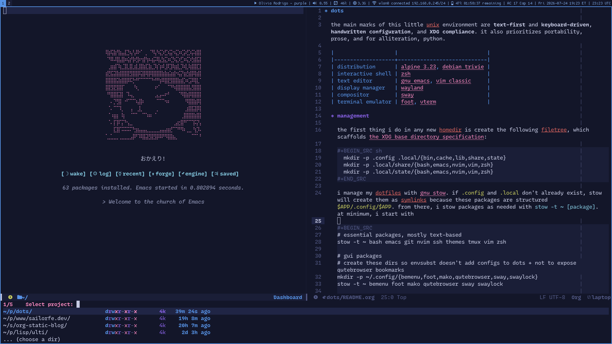

* dots

the main marks of this little unix environment are *text-first* and *keyboard-driven*, *handwritten configuration*, and *XDG compliance*. it also prioritizes portability,  prose, and for alliteration, python.

|                   |                            |
|-------------------+----------------------------|
| distribution      | [[https://alpinelinux.org][alpine 3.23]], [[https://debian.org][debian trixie]] |
| interactive shell | [[https://zsh.org][zsh]]                        |
| text editor       | [[https://gnu.org/software/emacs][gnu emacs]], [[https://vim-classic.org][vim classic]]     |
| display manager   | [[https://wayland.freedesktop.org/][wayland]]                    |
| compositor        | [[https://swaywm.org][sway]]                       |
| terminal emulator | [[https://codeberg.org/dnkl/foot][foot]], [[https://github.com/akermu/emacs-libvterm][vterm]]                |

** management

the first thing i do in any new homedir is create the following filetree, which scaffolds [[https://specifications.freedesktop.org/basedir-spec/basedir-spec-latest.html][the XDG base directory specification]]:

#+BEGIN_SRC sh
  mkdir -p .config .local/{bin,cache,lib,share,state}
  mkdir -p .local/share/{bash,emacs,nvim,vim,zsh}
  mkdir -p .local/state/{bash,emacs,nvim,vim,zsh}
#+END_SRC

i manage my dotfiles with [[https://gnu.org/software/stow][gnu stow]]. if ~.config~ and ~.local~ don't already exist, stow will create them as symlinks because these packages are structured ~$APP/.config/$APP~. from there, i stow packages as needed with =stow -t ~ [package]=. at minimum, i start with

#+BEGIN_SRC
# essential packages, mostly text-based
stow -t ~ bash emacs git nvim ssh themes tmux vim zsh

# gui packages
# create these dirs so envsubst doesn't add configs to dots + not to expose qutebrowser bookmarks
mkdir -p ~/.config/{bemenu,foot,mako,qutebrowser,sway,swaylock}
stow -t ~ bemenu foot mako qutebrowser sway swaylock

# media packages
# create mpd dir to keep library.db out of repo
mkdir -p ~/.config/mpd
stow -t ~ beets mpd mpv ncmpcpp zathura
#+END_SRC

but if you're shopping any of these configs, feel free to stow them wherever you like in your homedir.

there are also setup scripts really intended only for my use at the root of this repository. they're iterated as i live in my computers more, so i haven't tested them extensively in VMs or anything like that.

** shell

i use [[https://zsh.org][zsh]] as my interactive shell and script in bash. zsh was my first shell via macOS monterey, and i keep a minimal ~.bashrc~ that lags a bit behind. i find zsh plenty luxurious with extensions like [[https://github.com/zsh-users/zsh-autosuggestions][zsh-autosuggestions]], [[https://github.com/zsh-users/zsh-completions][zsh-completions]], and [[https://github.com/zsh-users/zsh-syntax-highlighting][zsh-syntax-highlighting]], which all purport to be ~fish~-like.

the most esoteric thing i do with my shell is export 16 variables for custom palettes and switch between them based on ~$(hostname)~. i work across a [[https://tailscale.com][tailnet]] of four physical devices and a hetzner VPS. to know where tf i am, i don't rely on the text of my zsh prompt alone, but foreground colors that differ per theme /and/ changing the terminal emulator background with the OSCs (operating system commands) ~11~ and ~111~[fn:1].

my custom palettes are all [[https://en.wikipedia.org/wiki/Toei_Animation][toei-animation]]-themed and mostly started as [[https://github.com/rktjmp/lush.nvim][lush.nvim]] colorschemes: [[https://codeberg.org/sailorfe/perona.nvim][perona]], [[https://codeberg.org/sailorfe/luna.nvim][luna]], [[https://codeberg.org/sailorfe/moonqueen.nvim][moonqueen]] and most recently, emacs-native [[https://codeberg.org/sailorfe/ulti][ulti]]. after much experimentation, i follow the [[https://rosepinetheme.com][rosé pine]] model of six accent colors used for syntax highlighting plus a range of backgrounds and foregrounds where bright versions of the accents are only used for terminal ANSI.

these shell variables are also consumed by ~envsubst~ for gui ricing in [[https://swaywm.org][sway]] where my version-controlled configs for [[https://codeberg.org/dnkl/foot][foot]], [[https://github.com/emersion/mako][mako]] et al are all templates. in the case of [[https://qutebrowser.org/][qutebrowser]], my config uses environmental variables directly thanks to python ~os~. 

besides colors, i export all manner of environmental variables to wrangle file paths into XDG submission, especially pesky language libraries like ~cargo~ that germinate all over ~$HOME~ if left alone. there's also a few (again, host-based) conditionals that help with portability between linux distributions, and between clients with sway and servers without. my only aliases append ~--color=auto~ and ~--group-directories-first~ to ~ls~ and ~grep~ commands.

i wrote my zsh prompt to just be ~HH:MM:SS~ plus ~.venv~ and VCS awareness, of course in shell-informed colors.

[fn:1] [[https://www.xfree86.org/current/ctlseqs.html][XFree66, ctlseqs]]: Under "Operating System Controls," ~"P s = 1 1 → Change VT100 text background color to P t."~

** text editors

these days i use [[https://gnu.org/software/emacs][gnu emacs]] for intensive work and hop into [[https://vim-classic.org][vim classic]] for quick edits, but this repository includes my [[https://neovim.io][neovim]] setup for posterity.

i configure both neovim and emacs by hand and try to keep extensions on the lean side. as of writing, my lisp files explicitly name 32 packages compared to the 22 plugins in my nvim ~pack/~ directory. per ~straight.el~, i have a total of 62 emacs packages including dependencies. by "by hand," i mean i have a resistance to text editor distributions that one could call ascetic, but honestly arises from most of what i write is english. i have narrow needs and a narrow language stack, and i don't think the communities behind frameworks and IDE layers really have "writer who only programs a few days a week" in mind.

*** neovim

i used vim and neovim for four years, neovim for the latter two with [[https://github.com/folke/lazy.nvim][lazy.nvim]] as my plugin manager until some (entirely solvable) frustrations with ssh led me to abandon it for pulling plugins as git submodules in ~$XDG_DATA_HOME/nvim/site/pack/plugins~, part of nvim's default runtime path. this worked great for me because (1) i had only 22 plugins and lazy loading them was as simple as dividing them across ~start/~ and ~opt/~ and (2) i tend to either use whatever nvim is in my distribution's package repository or build it from stable. i've used nvim 0.9, 0.10 and 0.11, none of this nightly business, so i had no reason to keep plugins on the bleeding edge.

see [[file:nvim/README.org][my nvim README]] for detailed instructions on rawdogging plugin management.

*** emacs

however, the grass is always greener, and by grass i mean [[https://orgmode.org][org-mode]]. i used the classic [[https://github.com/vimwiki/vimwiki][vimwiki]] in vim and later [[https://github.com/serenevoide/kiwi.nvim][kiwi.nvim]] for project management and organizing my markdown notes, and each lasted no more than a month or so. for context, my markdown notes have followed a [[https://en.wikipedia.org/wiki/Zettelkasten][zettelkasten]] system to varying degrees of success and at this point have years of rot, so the org-mode feature that fits into my habits best is org-capture to replace zettelkasten's "fleeting." i used a bash script with bemenu to add fleeting notes, never had a great discipline about refiling them, and chafed at needing sway for this workflow. converting existing markdown files to org would be absurd, so my .org files link to extant .md files while new notes originate in .org.

before this, i had a few false starts trying emacs where i never got further than crying and puking over chorded keybindings (not helped by using a 40% keyboard), but some videos about [[https://github.com/doomemacs/core][doom emacs]] finally pushed me for the mere prospect of [[https://github.com/emacs-evil/evil][evil mode]] out of the box. i gave doom a shot for a good few days, less than a week, and liked it enough to throw it out and start from scratch. /which is an earnest compliment!/ i treated doom as a tasting menu, more or less, the same way my earliest neovim config was frankensteined together from blogs and public dotfiles. doom is an opinionated, generous configuration that isn't actually that prescriptive; the toggleable ~doom/init.el~ surveys the package landscape with overlapping options per domain. i walked away with a place to start.

see [[file:emacs/README.org][my emacs README]] for a few external package dependencies and my systemd and openrc user services for the daemon. 

*** prose extensions

anybody else who's switched sides could tell you other package equivalences, especially for development, which of course can't be 1:1, but i have the strongest opinions about setting up a writing environment. /i/ need:

+ *a zen mode*, [[https://github.com/shortcuts/no-neck-pain.nvim][no-neck-pain.nvim]] \to [[https://githbub.com/rnkn/olivetti][olivetti]].
+ *markdown rendering*, [[https://github.com/MeanderingProgrammer/render-markdown.nvim][render-markdown.nvim]] \to [[https://github.com/jrblevin/markdown-mode][markdown-mode]].
+ *spellcheck that makes any kind of sense*, built-in vim spell \to [[https://githbub.com/minad/jinx][jinx]]. if you come from prose writing in vim, do not bother with flyspell, emacs' default. jinx best approximates the vim spellfile experience of ~zg~ and ~zG~ to add words to a personal plain text dictionary on the fly with just a few more, finer options, like creating the exception only for the session or working directory. i'm a huge fan.

*** with XDG directories

vim and emacs insist upon =~/.vim= and =~/.emacs.d=, and curtailing this leaves my shell's hands and enters each of their configs. see [[file://emacs/.config/emacs/early-init.el][early-init.el]] and the first lines of my [[file:vim/.config/vim/vimrc][.vimrc]] for how i manage this.

** fonts

an odd note to end on, but i like open source fonts and cycle through a few that i think are quite underrated.

+ [[https://recursive.design][recursive mono casual]] with my favorite italic i've ever seen.
+ [[https://github.com/rbanffy/3270font][ibm 3270]] and its [[https://github.com/ryanoasis/nerd-fonts/tree/master/patched-fonts/3270][nerd font]]. it looks fantastic on the larger side.
+ [[https://github.com/the-moonwitch/Cozette][cozette]], a bitmap font i use on sway surfaces.
+ [[https://github.com/yuru7/moralerspace][moralerspace]] neon and radon. this whole family is reliable for CJK rendering (duh), but radon is more of a handwritten-looking wildcard.

the joy i find in exploring these means i simply love computers. i've seen people who live on mechanical keyboards attached to tablets, but the hassle of woff2base and fighting, say, ipad OS to accept personal fonts simply makes me love desktop linux, as much as i've harped on about my shell environment.

i also tried mixed pitch in emacs for all of two minutes. it is not for me.

** license

these configs and scripts are released with [[https://unlicense.org][the unlicense]] / [[https://kopimi.com][kopimi]].

[[file:https://upload.wikimedia.org/wikipedia/commons/thumb/3/3f/Kopimi_k.svg/250px-Kopimi_k.svg.png]]
